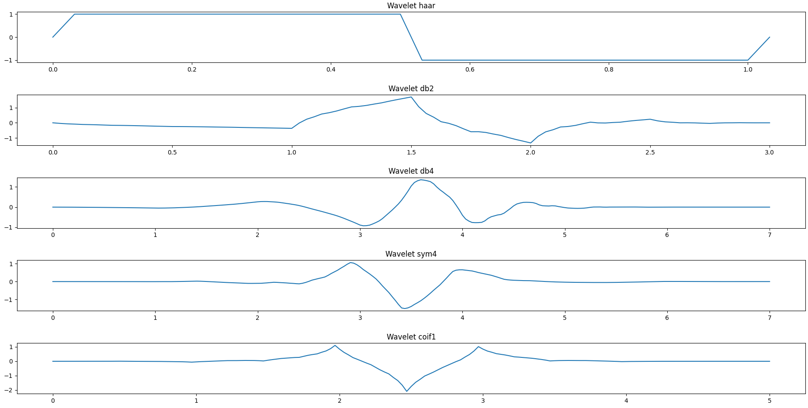
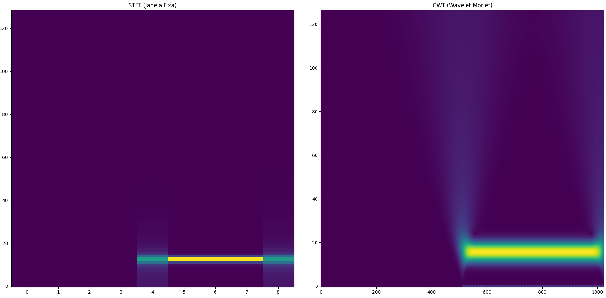

# Básico de Wavelet

## Sumário

- [Introdução](#introdução)
- [Função Wavelet](#função-wavelet)
- [Formato das Wavelets no Tempo](#formato-das-wavelets-no-tempo)
- [Wavelets e as Escalas](#wavelets-e-as-escalas)
- [Comparação das Funções STFT x CWT](#comparação-das-funções-stft-x-cwt)

## Introdução

A transformada wavelet é uma técnica utilizada para analisar sinais no tempo e na frequência simultaneamente, sendo especialmente útil quando se trabalha com sinais que variam ao longo do tempo, isto é, sinais não estacionários. Como exemplo, pode-se citar uma música: ao longo da canção, há variações constantes nas frequências presentes nas vozes (mais agudas ou mais graves) e nos instrumentos.

Essa transformada, diferentemente da transformada de Fourier, permite identificar quais frequências estão presentes e em que instantes de tempo elas ocorrem, algo que a transformada de Fourier não consegue representar de forma consistente para sinais não estacionários.

## Função Wavelet

Para compreendermos suas aplicações, é importante entender o que é uma função wavelet. A wavelet nada mais é do que uma função de curta duração, localizada em um determinado intervalo de tempo, que oscila e, em seguida, desaparece.

Uma analogia comum é compará-la a uma lupa: ela está localizada no tempo, sua ação ocorre quando observamos uma região específica e desaparece quando deixamos de observá-la. Nesse sentido, a wavelet pode ser entendida como uma lupa deslizante, que percorre o sinal (seja ele uma música, uma imagem ou outro tipo de dado) aproximando diferentes trechos. A partir dessa varredura, é possível extrair padrões presentes no sinal em diferentes escalas.

No código em Python, esses padrões aparecem na forma de funções, tais como:
- ψ(t) → função wavelet (detalhes, altas frequências);
- φ(t) → função escala (aproximação, baixas frequências).

## Formato das Wavelets no Tempo

Na primeira parte do código, são apresentados alguns formatos de funções wavelet mãe existentes, das quais são: Haar, Daubechies (db2, db4), Symlet (sym4) e Coiflet (coif1).

Cada gráfico representa ψ(t) no domínio do tempo.

Essas funções são chamadas de funções-mãe porque é a partir delas que os sinais são analisados. Elas são o "formato da lupa" que varre o sinal, permitindo observar seus detalhes em diferentes regiões do tempo.

Figura 1 – Wavelets discretas das famílias Haar, Daubechies, Symlet e Coiflet

Fonte: Elaborado pela autora (2026).

Cada função wavelet mãe possui aplicações específicas, que podem ser resumidas da seguinte forma:

- Haar: é a mais simples e descontínua, sendo indicada para a detecção de mudanças bruscas no sinal.

- Daubechies, Symlet e Coiflet: apresentam uma construção mais suave e, por isso, representam melhor sinais reais. São amplamente utilizadas em aplicações de compressão (como o padrão JPEG2000) e em filtragem.

Mesmo representando a mesma ideia (detalhes do sinal), cada wavelet possui um formato diferente, o que influencia a maneira como as variações do sinal são detectadas.

## Wavelets e as escalas

Na wavelet, não falamos diretamente em frequência, mas em escala:

- Escala pequena: wavelet comprimida → alta frequência;
- Escala grande: wavelet esticada → baixa frequência.

Isso permite analisar o sinal com resolução variável, ou seja, nos permite boa resolução no tempo para altas frequências e também boa resolução em frequência para baixas frequências.

Esse conceito é chamado de análise **multirresolução**.

# Comparação das Funções STFT x CWT

A segunda parte do código em Python realiza uma comparação entre a Transformada de Fourier de Curto Prazo (STFT), também conhecida como análise por **janela fixa**, e a Transformada Wavelet Contínua (CWT), frequentemente associada ao conceito de **janela adaptativa**.

Figura 2 – Comparação das duas técnicas (STFT e CWT) de análise des sinais

Fonte: Elaborado pela autora (2026).

Na técnica STFT, o sinal é analisado utilizando uma janela de tamanho fixo, o que implica que a resolução no tempo e na frequência permanece constante ao longo de toda a análise. Dessa forma:

- Janela curta: permite boa resolução no tempo;
- Janela longa: proporciona melhor resolução em frequência.

Contudo sua limutação é justamente não se adaptar ao sinal em si. 

Já a CWT consegue se adaptar automaticamente com o sinal, fazendo o ajuste de acordo com a fequencia:
- Alta frequência usam janelas curtas;
- Baixa frequência usam janelas longas.

E por isso o instante analistado do sinal fica mais bem definido, destacando melhor as mudanas encontradas. Este gráfico é chamado de **escalograma**.