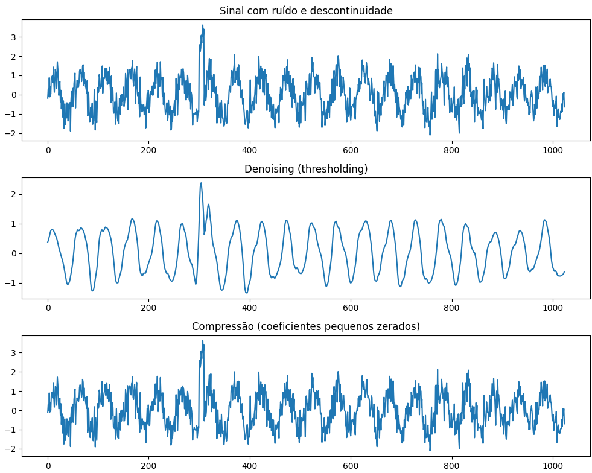

# Análise Wavelet para Denoising e Compressão de Sinais

## Sumário

- [Geração do sinal com ruído e descontinuidade](#introdução)
- [Decomposição Wavelet Discreta (DWT)](#implementar-DWT)
- [Estimativa do ruído e threshold universal](#reconstrução-(IDWT))
- [Denoising por thresholding suave](#entendendo-os-coeficientes)
- [Compressão por anulação de coeficientes pequenos](#diferentes-wavelets-mãe)
- [Conclusão](#conclusão)
- [Referências](#referências)

## Geração do sinal com ruído e descontinuidade

O sinal analisado combina uma frequência de 20 Hz com ruído de fundo. Adicionamos uma "falha" proposital entre as amostras 300 e 310 para simular saltos bruscos que ocorrem em sinais reais. Esses saltos são difíceis de identificar apenas com a Transformada de Fourier, por isso a importância dessa descontinuidade no teste.

## Decomposição Wavelet Discreta (DWT)

Utilizamos a wavelet Daubechies 4 (db4), que é um padrão no mercado para comprimir sinais e limpar ruídos. Ao decompor o sinal até o nível 4, conseguimos separá-lo em dois grupos: os coeficientes de aproximação (que mostram as frequências baixas e a tendência do sinal) e os de detalhe (que captam as frequências altas e ruídos).

Essa técnica, baseada na análise de multirresolução de Mallat, funciona como uma "lupa", permitindo que a gente examine o sinal em diferentes escalas de tempo e frequência simultaneamente.

## Estimativa do ruído e threshold universal

```python
sigma = np.median(np.abs(coeffs[-1]))/0.6745
uth = sigma * np.sqrt(2*np.log(len(sig)))
```
Utilizamos o limiar (threshold) universal de Donoho e Johnstone para decidir o que é ruído e o que é sinal. 

O cálculo funciona assim:

- Estimativa do Ruído: Olhamos para os detalhes mais finos do sinal (coeffs[-1]), onde o ruído é mais fácil de notar. Usamos a mediana desses valores para calcular o desvio padrão ($\sigma$), garantindo que a estimativa não seja distorcida por picos isolados.

- Cálculo do Corte: O valor de corte ($uth$) é definido com base no tamanho do sinal e nesse ruído calculado

- Objetivo: Esse limite é matematicamente otimizado para remover o máximo de sujeira possível, mantendo o erro entre o sinal original e o reconstruído o menor possível.

## Denoising por thresholding suave

```python
coeffs_f = [coeffs[0]] + [pywt.threshold(c, uth, mode='soft') for c in coeffs[1:]]
sig_denoised = pywt.waverec(coeffs_f, wavelet)
```
Nesta etapa, realizamos a limpeza final do sinal seguindo estas regras:

- O que fica: Mantemos os coeficientes de aproximação intactos, pois eles carregam a estrutura principal do sinal.

- O que muda: Aplicamos o threshold suave nos detalhes. Isso significa que eliminamos os ruídos pequenos (zerando-os) e reduzimos suavemente os valores maiores.

- O resultado: Ao reconstruir o sinal, essa suavidade evita "degraus" ou distorções artificiais, entregando um resultado muito mais limpo e natural.

## Compressão por anulação de coeficientes pequenos

```python
coeffs_c = [np.where(np.abs(c)>0.2, c, 0) for c in coeffs]
sig_compressed = pywt.waverec(coeffs_c, wavelet)
```
Nesta outra etapa, realizamos uma compressão direta do sinal:

- Filtro de Importância: Definimos um corte fixo onde apenas os coeficientes mais fortes são mantidos. Tudo o que for pequeno demais é descartado (zerado).

- Concentração de Energia: A lógica é que quase toda a informação importante do sinal está "espremida" em poucos coeficientes.

- Eficiência: Ao guardar apenas esses pontos essenciais, reduzimos drasticamente o tamanho dos dados sem que o ouvido ou o olho humano percebam uma perda real de qualidade.

## Conclusão



Fonte: Elaborado pela autora (2026).

O programa wavelets.py demonstra que a Transformada Wavelet Discreta é uma ferramenta eficiente para:

- Remoção de ruído em sinais não estacionários,

- Detecção e preservação de descontinuidades,

- Compressão de sinais, explorando a concentração de energia em poucos coeficientes.

Diferentemente da Transformada de Fourier, a abordagem wavelet permite tratar fenômenos locais no tempo, tornando-a especialmente adequada para sinais reais.

## Referências

- Mallat, S. (1999). A Wavelet Tour of Signal Processing. Academic Press.
- Donoho, D. L., & Johnstone, I. M. (1994). Ideal spatial adaptation by wavelet shrinkage. Biometrika.