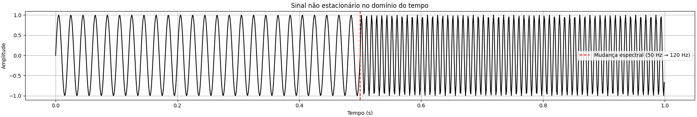
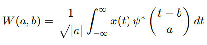
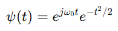
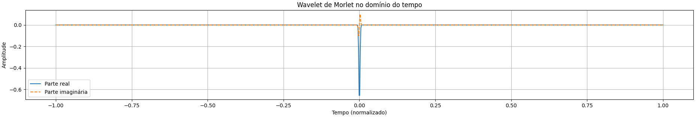
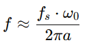
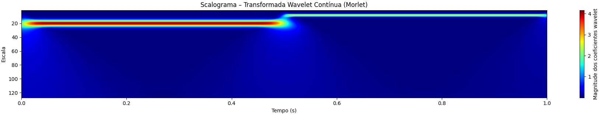

# Transformada Wavelet Contínua na Análise de Sinais Não Estacionários

## 1. Introdução

Sinais reais, como áudio, sinais biomédicos e imagens, são frequentemente não estacionários, isto é, suas características espectrais variam ao longo do tempo ou do espaço. Nesses casos, a Transformada de Fourier é limitada, pois fornece apenas informação global de frequência. A Transformada Wavelet Contínua (CWT) permite uma análise tempo–escala, possibilitando a identificação de eventos transitórios e mudanças espectrais localizadas.

Figura 1 – Sinal no domínio do tempo

Fonte: Elaborado pela autora (2026).

## 2. Conceito de Transformada Wavelet

A Transformada Wavelet baseia-se na decomposição do sinal utilizando uma wavelet-mãe **ψ(t)**, função oscilatória e localizada. A wavelet é escalada e transladada para analisar o sinal em diferentes resoluções.

A versão contínua da transformada é definida por:

onde:
- 𝑎 é a escala,
- 𝑏 é o deslocamento temporal,
- ∗ indica o complexo conjugado.

## 3. Transformada Wavelet Contínua (CWT)

A CWT analisa o sinal em um conjunto contínuo de escalas, resultando em um mapa bidimensional de coeficientes que representam a similaridade entre o sinal e a wavelet em cada instante e escala.

No código estudado, utiliza-se a wavelet de Morlet, definida como:

Essa wavelet oferece bom compromisso entre resolução temporal e espectral, sendo amplamente aplicada em sinais físicos e biomédicos.

Figura 2 – Forma da wavelet de Morlet

Fonte: Elaborado pela autora (2026).

## 4. Escala e Relação com Frequência

Na CWT, o eixo vertical do scalograma representa escala, não frequência direta. A relação aproximada entre escala e frequência para a wavelet de Morlet é dada por:

onde:
- Fs: é a frequência de amostragem,
- 𝑎:  é a escala.

Escalas pequenas correspondem a altas frequências, enquanto escalas grandes representam baixas frequências.

## 5. Interpretação do Scalograma

O scalograma é a representação gráfica da magnitude dos coeficientes wavelet:

- Scalograma = ∣W(a,b)∣

Ele permite visualizar a distribuição de energia do sinal no plano tempo–escala. No exemplo analisado, observa-se uma concentração de energia em escalas maiores na primeira metade do sinal (frequência mais baixa) e uma migração para escalas menores na segunda metade, caracterizando um sinal não estacionário.

Figura 3 – Forma da wavelet de Morlet

Fonte: Elaborado pela autora (2026).

## 6. Considerações Finais

A Transformada Wavelet Contínua constitui uma ferramenta poderosa para análise de sinais não estacionários, fornecendo uma representação rica no domínio tempo–escala. A correta interpretação do scalograma, respeitando o conceito de escala, é essencial para evitar conclusões equivocadas. Sua versatilidade justifica o amplo uso em aplicações de áudio, sinais biomédicos e processamento de imagens.