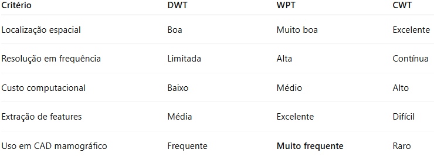
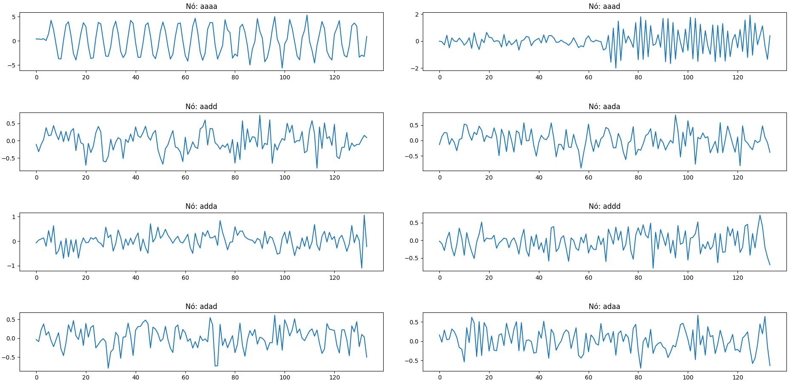

# WPT — Wavelet Packet Transform

A Wavelet Packet Transform (WPT) representa uma extensão da DWT tradicional, na qual não apenas a sub-banda de aproximação, mas também as sub-bandas de detalhe são recursivamente decompostas. Esse processo resulta em uma divisão mais uniforme do espectro de frequências, permitindo uma análise mais refinada das texturas presentes na imagem.

Em imagens mamográficas, essa característica torna a WPT especialmente adequada para a discriminação entre tecidos normais e regiões nodulares, uma vez que diferentes padrões de textura podem ser isolados em sub-bandas específicas. Diversos estudos demonstram que a utilização da WPT melhora significativamente a extração de características discriminantes, contribuindo para o aumento do desempenho de sistemas CAD voltados à detecção de nódulos.

Em resumo, a WPT é uma extensão da DWT, ou seja, enquanto a DWT decompõe apenas a aproximação a WPT:
- Decompõe aproximações e detalhes
- Gera uma divisão mais rica e uniforme do espectro

Cada nó representa uma sub-banda específica de frequência.

No gráfico da WPT gerado pelo programa __wavelet_packet.py__ mostra:

- Cada nó isola um comportamento espectral específico
- A mudança de frequência aparece mais localizada em certos nós

## Aplicação em mamografia

A WPT é especialmente útil para:
- Análise de textura mamária
- Separar padrões finos de textura associados a nódulos
- Extrair features discriminantes para classificação automática

## Comparação direta: WPT × DWT × CWT

### Gráfico

Ao executar o programa, é gerado como resultado o seguinte gráfico:

Figura 1 – Gráfico da WPT

Fonte: Elaborado pela autora (2026).

O gráfico apresentado ilustra os coeficientes da Wavelet Packet Transform (WPT) obtidos a partir de um sinal não estacionário, para um nível de decomposição específico. Cada subgráfico corresponde a um nó da árvore wavelet, identificado por sequências como aaaa, aaad, aadd, entre outras. Essas sequências representam o caminho percorrido na árvore de decomposição, indicando sucessivas filtragens passa-baixa (a) e passa-alta (d).

#### Nó aaaa — componente de baixa frequência dominante

O nó aaaa representa a sub-banda obtida após sucessivas filtragens passa-baixa. Observa-se um sinal suave, com oscilações regulares e maior coerência temporal, caracterizando a componente de baixa frequência do sinal original. Essa sub-banda concentra a maior parte da energia associada à estrutura global do sinal.

Em imagens mamográficas, essa sub-banda estaria associada à estrutura anatômica geral da mama, como regiões homogêneas de tecido, sendo menos sensível a nódulos ou microcalcificações.

#### Nó aaad — transição entre baixas e médias frequências

O nó aaad apresenta oscilações mais rápidas e maior variabilidade em relação ao nó aaaa, especialmente na segunda metade do sinal. Isso indica a presença de componentes de frequência mais elevada, associadas a mudanças locais no conteúdo espectral.

Essa sub-banda é sensível a mudanças locais de textura, o que, em mamografias, pode estar relacionado ao surgimento de estruturas suspeitas, como bordas de nódulos.

#### Nós aadd e aada — componentes intermediárias de frequência

Os nós aadd e aada exibem sinais com comportamento predominantemente irregular, menor amplitude e maior conteúdo de ruído aparente. Essas sub-bandas representam frequências intermediárias, onde padrões de textura mais sutis tendem a se manifestar.

Em análise de imagens mamográficas, essas sub-bandas são particularmente relevantes para caracterização de textura do tecido mamário, auxiliando na distinção entre regiões normais e regiões nodulares.

#### Nós adda, addd, adad e adaa — altas frequências

Os nós associados a caminhos com maior número de filtragens passa-alta apresentam sinais mais ruidosos, com rápidas variações e menor correlação temporal. Essas características indicam a predominância de componentes de alta frequência, geralmente associadas a bordas abruptas e ruído.

Em mamografias, essas sub-bandas são sensíveis a:
- bordas finas
- microcalcificações
- detalhes estruturais pequenos

No entanto, também são mais suscetíveis ao ruído, exigindo análise cuidadosa ou seleção de características apropriadas.